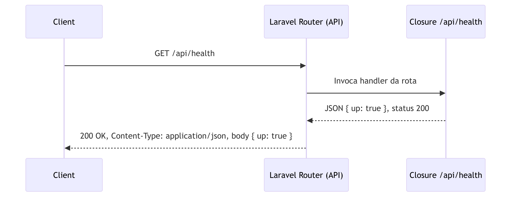
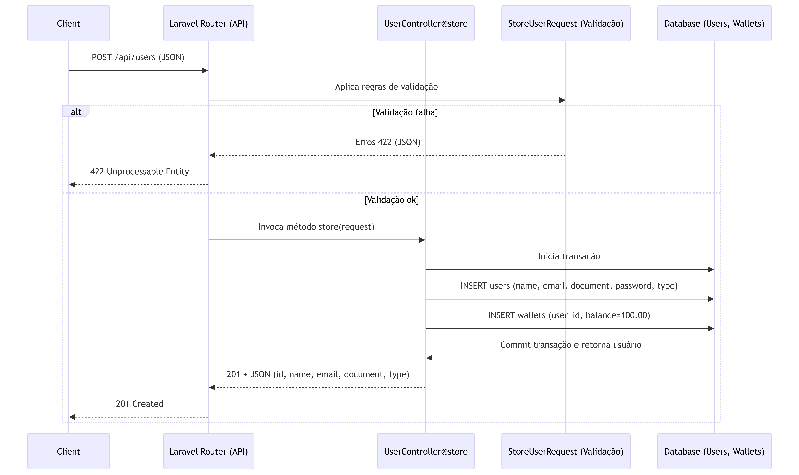
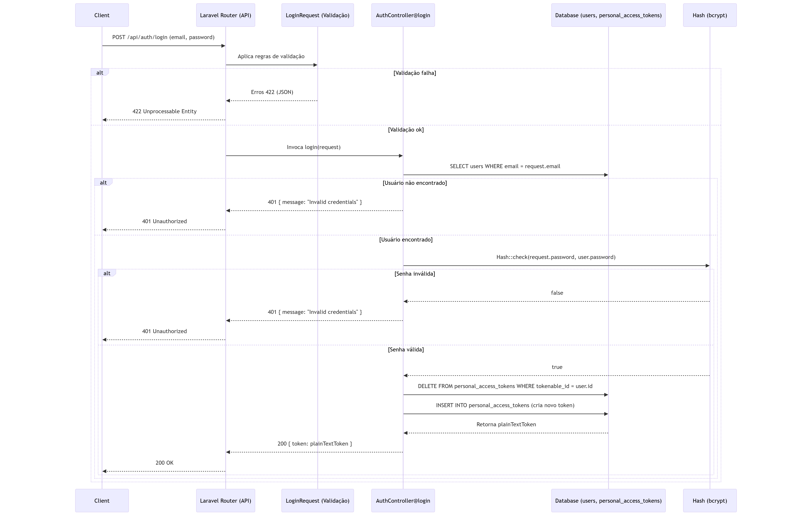

# Descrição do Projeto

Este projeto consiste em uma **API REST desenvolvida em Laravel**, focada em **simplicidade, organização e boas práticas de arquitetura**.  
A aplicação foi construída exclusivamente como **API (sem frontend)**, priorizando clareza de responsabilidades, padronização de respostas HTTP e versionamento controlado do banco de dados.

O objetivo principal foi desenvolver uma **API REST sólida**, utilizando de forma consciente os recursos nativos do Laravel, mantendo um código limpo, testável e de fácil manutenção.

---

## Instruções de Instalação

### 1. Clonar o repositório

```bash
git clone https://github.com/masson-felipe/laravel-rest-api
```

### 2. Criar o arquivo `.env` na raiz do projeto

Na raiz do projeto, crie o arquivo `.env` a partir do exemplo:

```bash
cp .env.example .env
```

Em seguida, preencha as variáveis de ambiente relacionadas à conexão com o banco de dados **MySQL**, conforme sua configuração local.

### 3. Subir o ambiente com Docker

Ainda na raiz do projeto, execute:

```bash
docker compose up --build
```
> **Nota sobre o build do container**
>
> Durante o build do container, pode ocorrer um erro indicando que o arquivo `/entrypoint.sh` não foi encontrado.  
> Isso geralmente acontece devido à formatação incorreta do arquivo.
>
> Certifique-se de que o `entrypoint.sh` esteja no formato **LF (Unix)** e não **CRLF (Windows)**.


Esse comando irá construir as imagens e iniciar o ambiente de desenvolvimento local.

### 4. Configurar o `.env` da aplicação Laravel

No arquivo `.env` localizado em `/laravel-api`, ajuste as variáveis de conexão com o banco de dados para que apontem para o container do MySQL:

```env
DB_CONNECTION=mysql
DB_HOST=db
DB_PORT=3306
DB_DATABASE=laravel
DB_USERNAME=laravel
DB_PASSWORD=laravel
```

### 5. Executar as migrations

Com os containers em execução, rode o comando abaixo para criar as tabelas no banco de dados:

```bash
docker exec -it laravel_app php artisan migrate
```

### 6. Executar os testes automatizados

Para rodar os testes da aplicação:

```bash
docker exec -it laravel_app php artisan test
```

### 7. Testar os endpoints da API

Os endpoints podem ser testados utilizando o **Postman**.
Basta importar a coleção disponível em:

```
docs/Laravel-Rest API.postman_collection.json
```

---

## Visão Geral

A API expõe **quatro rotas principais**, cobrindo os fluxos essenciais do desafio.  
Ao longo desta documentação, cada rota é detalhada, incluindo:

- Finalidade da rota
- Fluxo de execução
- Validações e regras de negócio
- Dependências externas
- Estruturas de requisição e resposta (incluindo códigos HTTP)
- Diagramas de sequência representando o fluxo da operação

---

## Tecnologias Utilizadas

- **Laravel 12.44**
- **PHP 8.2**
- **Docker** - Ambiente de desenvolvimento local
- **MySQL** - Banco de dados relacional
- **Composer** - Gerenciamento de dependências
- **Git** - Controle de versão

---

## Decisões de Arquitetura

Este projeto possui uma implementação equivalente desenvolvida anteriormente em PHP puro ([API REST sem framework](https://github.com/masson-felipe/api-php)). Nessa abordagem, há uma maior quantidade de código autoral, uma vez que não se conta com abstrações ou métodos fornecidos por um framework, exigindo a implementação manual de diversas responsabilidades comuns a uma API REST.

Para esta versão aqui em Laravel, a decisão foi priorizar simplicidade, produtividade e aderência ao framework, utilizando seus recursos nativos para acelerar o desenvolvimento, reduzir código boilerplate e garantir consistência arquitetural ao longo da aplicação.

A aplicação foi estruturada seguindo boas práticas de separação de responsabilidades, com Controllers enxutos, regras de negócio centralizadas em Services e integrações com serviços externos devidamente desacopladas da lógica principal, favorecendo manutenção, testabilidade e evolução do código.

---

## Princípios de Design (SOLID)

A arquitetura do projeto possui alguns princípios **SOLID**:

- **Single Responsibility Principle (SRP)**  
  Cada classe possui uma responsabilidade bem definida (Controllers, Services, regras de negócio e integrações externas são isoladas).
- **Open/Closed Principle (OCP)**  
  Serviços externos, como autorização e notificação, podem ser estendidos ou substituídos sem a necessidade de modificar o fluxo principal da aplicação.
- **Dependency Inversion Principle (DIP)**  
  As dependências são resolvidas via injeção pelo container do Laravel, facilitando testes, manutenção e desacoplamento entre camadas.

Essas decisões contribuem diretamente para a **testabilidade**, **manutenção** e **clareza do código**.

---

## Estrutura do Projeto

### Ambiente Docker

O projeto conta com um ambiente Docker configurado para desenvolvimento local, garantindo paridade entre ambientes e facilidade de execução.

**Componentes:**
- PHP 8.2 + Laravel 12.44
- MySQL
- Arquivos principais:
    - `Dockerfile`
    - `docker-compose.yml`

---
### Migrations

O versionamento do banco de dados é realizado utilizando as **migrations do Laravel**, as migrations estão localizadas em `database/migrations`

---
### Código-fonte

Toda a lógica da aplicação está concentrada no diretório `laravel-api/`.

Nesta estrutura encontram-se:

- Controllers
- Services (regras de negócio)
- Repositórios / Models
- Validações
- Configurações da aplicação

A separação entre camadas foi adotada para manter o código organizado, legível e alinhado com boas práticas de arquitetura para APIs REST.

---
### Testes

O projeto conta com **testes automatizados utilizando PHPUnit**, cobrindo os principais fluxos da aplicação e regras de negócio críticas.

Os testes foram estruturados em:

- **Feature Tests** - Validação do comportamento das rotas da API

---
# Visão geral - Rotas API

Esta API expõe quatro rotas principais. A seguir, você encontra uma documentação detalhada de cada rota:

### GET `/api/health`

Propósito: Verificação simples de disponibilidade (health check) da API.

```http
GET /api/health
Content-Type: application/json
```

#### Respostas
- 200 `{ "up": true }`
- 429 Too Many Requests
- 5xx Erros do servidor (falhas inesperadas)

### Diagrama de sequência da rota:



---

### POST `/api/users`

#### Propósito
Criação de um novo usuário da aplicação. Ao criar o usuário, uma carteira (wallet) é criada automaticamente com saldo inicial de `100.00`.

```http
POST /api/users
Content-Type: application/json
Accept: application/json

{
  "name": "Fulano de Tal",
  "email": "fulano@example.com",
  "document": "12345678901",
  "password": "secret",
  "type": "USER"
}

```

#### Respostas
- 201 Created
    - Corpo da resposta (exemplo):
      ```json  
      {
        "id": 1,
        "name": "Fulano de Tal",
        "email": "fulano@example.com",
        "document": "12345678900",
        "type": "USER"
      }  
      ```

- 422 Unprocessable Entity (erros de validação)
    - Corpo da resposta (exemplo):
      ```json
      {
        "message": "The email has already been taken.",
        "errors": {
          "email": [
            "The email has already been taken."
          ]
        }
      }
      ```
        - Pode ocorrer para: email/document já existentes, formato inválido, campos ausentes, `password` menor que 6, `type` fora do conjunto permitido.

- 429 Too Many Requests

- 5xx Erros do servidor (falhas inesperadas)

### Diagrama de sequência da rota `/api/users`:



#### Observações
- Duplicidade de `email` ou `document` é tratada na validação (retorna 422).

---

### POST `/api/auth/login`

#### Propósito
Autenticar um usuário existente e emitir um token de acesso (Laravel Sanctum) para chamadas autenticadas à API.

```http
POST /api/auth/login
Content-Type: application/json
Accept: application/json

{
  "email": "fulano@example.com",
  "password": "secret"
}
```

#### Respostas
- 200 OK
    - Corpo da resposta (exemplo):
      ```json  
      {  
        "token": "<token-de-acesso>"    
      }  
      ```  
        - Retorna um Bearer Token para ser usado no header `Authorization: Bearer <token>` nas rotas protegidas por `auth:sanctum`.

- 401 Unauthorized (credenciais inválidas)
    - Corpo da resposta (exemplo):
      ```json  
      { "message": "Invalid credentials" }  
      ```  
- 422 Unprocessable Entity (erros de validação)
    - Corpo da resposta (exemplo):
      ```json  
      {
        "message": "The email field must be a valid email address.",
        "errors": {
          "email": ["The email field must be a valid email address."]
        }
      }  
      ```  
- 429 Too Many Requests
- 5xx Erros do servidor (falhas inesperadas)

### Diagrama de sequência da rota `/api/auth/login`:



#### Observações
- Indispensável usar HTTPS em produção para proteger o envio de credenciais e do token.

---

### POST `/api/transactions`

#### Propósito
Realizar uma transferência de saldo entre usuários, debitando a carteira do pagador (`payer`) e creditando a carteira do recebedor (`payee`). Cria um registro de transação e dispara uma notificação ao recebedor.

```http
POST /api/transactions
Authorization: Bearer <TOKEN_AQUI>
Content-Type: application/json
Accept: application/json

{
  "value": 15.25,
  "payee_id": 2
}
```

#### Respostas
- 201 Created
    - Corpo da resposta (exemplo):
      ```json  
      {
        "id": 123,
        "value": 15.25,
        "payer_id": 1,
        "payee_id": 2,
        "status": "APPROVED"
      }  
      ```  
- 401 Unauthorized
    - Quando não houver token válido (`auth:sanctum`).
    - Corpo da resposta (exemplo):
      ```json  
      { "message": "Unauthenticated." }  
      ```  
- 403 Forbidden
    - Quando o `payer` for `MERCHANT`:
      ```json  
      { "message": "Lojista não podem enviar dinheiro" }  
      ```  
      - Quando a autorização externa negar:  
      ```json  
      { "message": "Transação não autorizada" }  
      ```  
- 422 Unprocessable Entity
    - Erros de validação (`value`, `payee_id`).
    - Regras de negócio: auto-transferência ou saldo insuficiente.
    - Exemplos:
      ```json  
      { "message": "Não é possível transferir para si mesmo" }  
      ```    
      ```json  
      { "message": "Saldo insuficiente" }  
      ```  
- 429 Too Many Requests
- 5xx Erros do servidor (falhas inesperadas)

### Diagrama de sequência da rota `/api/transactions`:


#### Observações
- A criação e atualização de `Notification` ocorrem fora da transação principal, para não impedir a confirmação financeira caso o envio do e-mail falhe.
- Tipos de usuário: `USER` pode enviar; `MERCHANT` apenas receber.
- Indispensável usar HTTPS em produção para armazenar o token com segurança para chamadas autenticadas.